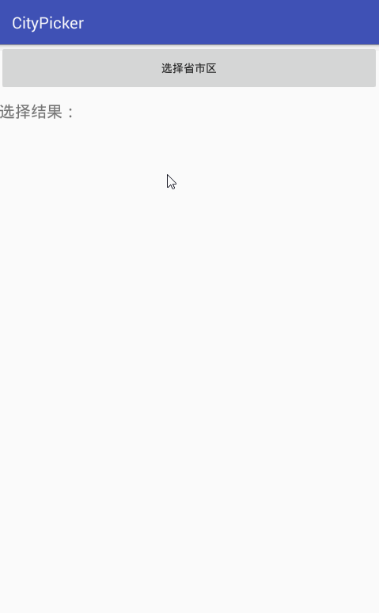

实际的项目中通常传递给后台的只是一个areaId，在sql文件夹下有.sql及.xls可以导入到数据库里，里面的areaId和项目里取到的ID是对应的。


 

#### gradle引用

```java
compile 'com.github.once10301:CityPicker:1.0.0'
```

#### 代码示例

```java
CityPicker cityPicker = new CityPicker.Builder(MainActivity.this).textSize(20)
      .textColor(Color.parseColor("#333333"))
      .onlyShowProvinceAndCity(false)
      .confirTextColor("#16b3f4")
      .cancelTextColor("#000000")
      .visibleItemsCount(7)
      .province("湖北省")
      .city("黄冈市")
      .county("红安县")
      .provinceCyclic(false)
      .cityCyclic(false)
      .countyCyclic(false)
      .itemPadding(10)
      .build();

cityPicker.show();
cityPicker.setOnCityItemClickListener(new CityPicker.OnCityItemClickListener() {
  @Override
  public void onSelected(String... citySelected) {
    tvResult.setText("选择结果：\n省：" + citySelected[0] 
        + "\n市：" + citySelected[1] + "\n县：" + citySelected[2] 
        + "\nID：" + citySelected[3]);
  }
});
```

#### 属性说明


> textSize

滚轮文字的大小，int 类型，默认为18

> textColor

滚轮文字的颜色 ，int 类型，默认为0xFF333333

> onlyShowProvinceAndCity(boolean flag)

省市两级联动，boolean 类型，默认false，三级联动

> confirTextColor

确认按钮文字的颜色 ，int 类型，默认为#16b3f4

> cancelTextColor

取消按钮文字的颜色 ，int 类型，默认为#000000

> visibleItemsCount

滚轮显示的item个数，int 类型，默认为7个

> provinceCyclic

省市滚轮是否循环显示，boolean 类型，默认为false

> cityCyclic

市区滚轮是否循环显示，boolean 类型，默认为false

> countyCyclic

县滚轮是否循环显示，boolean 类型，默认为false

> province

设置默认省 ，String类型，默认为北京市

> city

设置默认市 ，String 类型，默认为东城区

> county

设置默认县，String 类型，默认为""

> itemPadding

滚轮item间距，默认为10px

#### 结果返回

只需传入Context便可获取选择的省市区域的信息，结果返回四项，可根据自己的实际需求进行选择。

1. citySelected[0]：表示：省市
2. citySelected[1]：表示：市区
3. citySelected[2]：表示：县
4. citySelected[3]：表示：ID


### 感谢

很多地方参考了这位大神的代码

- [https://github.com/crazyandcoder/citypicker]